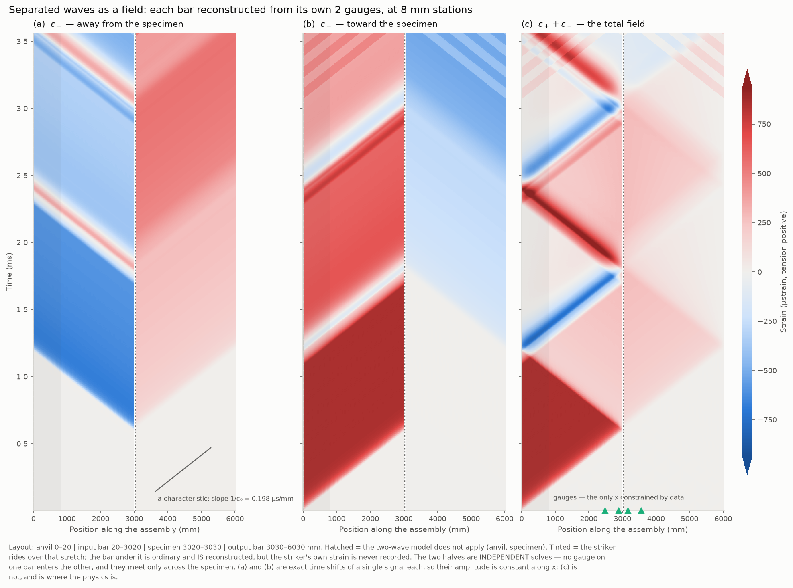
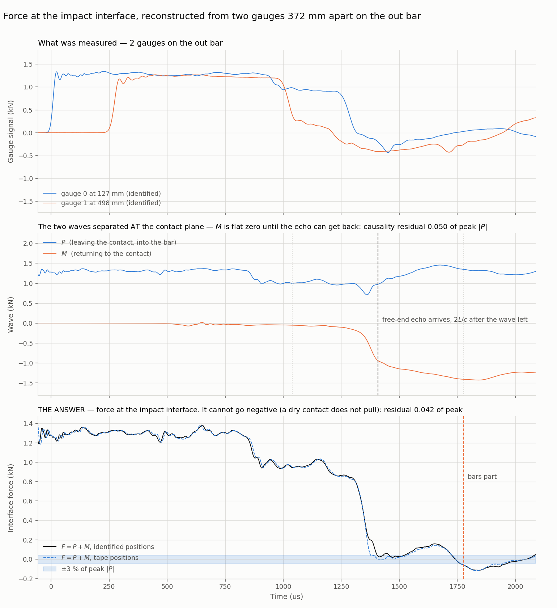
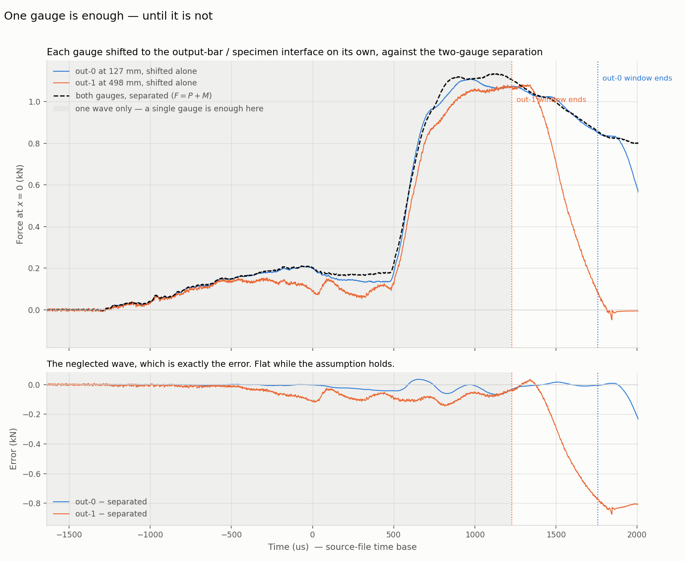

# Wave separation in Python

A Python port of the three-gauge wave separation in `Prog_Treat/a05.m`
(`wave_separation3`), together with the reduction from separated waves to
specimen stress/strain, and a validation against a 1D Hopkinson bar simulation.

## Quick start

```bash
python3 drive_compression.py             # ~1 s  -> dump.npz
python3 reduce_specimen.py   # ~2 s  -> specimen_reconstruction.png
```

`drive_compression.py` runs the simulation and records the gauge signals;
`reduce_specimen.py` does the actual wave reconstruction. You only re-run
`drive_compression.py` when you change a simulation parameter — the reconstruction reads
`dump.npz`, so iterating on the analysis is a 2-second loop.

There is a second simulator, a Split Hopkinson **tension** bar driven by a
striker. It writes the same filename, so run one or the other:

```bash
python3 drive_tension.py     # SHTB instead of the compression bar
```

Its data is TENSION POSITIVE, and the dump says so — `reduce_specimen.py` reads
the sign convention rather than being told. Unlike the compression model it
produces genuine incident/reflected **overlap** at the input-bar gauge, which is
the case multi-gauge separation exists for.

### Always run a driver, never a simulator

`simulate_compression.py` and `simulate_tension.py` are modules, not scripts. **Do not run
them directly.** Both have a `__main__` block, so doing it looks like it works —
the full simulation runs and `specimen.dat` gets written — but **no `dump.npz` is
produced**, and every analysis script afterwards then either fails outright or
silently reads the dump left over from some earlier run. That is a bug you can
stare at for a while.

A simulator also always falls back to its own default case, so
`python3 simulate_tension.py` can only ever give you `[tension]` — there is no
way to reach `[calibration_tension]` through it.

| to get | run | never run |
|---|---|---|
| direct-impact compression bar | `python3 drive_compression.py` | `simulate_compression.py` |
| SHTB with a specimen | `python3 drive_tension.py` | `simulate_tension.py` |
| connected-bar calibration shot | `python3 drive_calibration_tension.py` | `simulate_tension.py` |
| direct-impact calibration shot | `python3 drive_calibration_compression.py` | `simulate_compression.py` |
| a MEASURED shot | nothing — `identify_bar_compression.py --experiment CASE` reads the file itself | any driver |

The drivers are three lines each and set nothing themselves; they pick a case out
of `config.toml`, run the model and write the dump. The simulators are kept
importable so that a parameter sweep can override the config and run the model in
memory without touching `dump.npz` — that is what the 59-gauge comb in
[Where to put the gauges](#where-to-put-the-gauges) was done with, and it is the
only reason to import one.

## Everything is configured in one file

`config.toml` holds all three cases — materials, geometry, gauge locations,
numerics and the analysis `eta`. The drivers and the analysis scripts read it;
nothing is hardcoded in the Python any more. To move a gauge or change the
striker, edit `config.toml` and re-run the driver.

Two further cases exist, one per rig, in which the bars are joined with **no
specimen** and the gauge positions and `c0` are measured from the record itself:

```bash
python3 drive_calibration_tension.py     && python3 identify_bar_tension.py
python3 drive_calibration_compression.py && python3 identify_bar_compression.py
```

See [Calibrating the bar](#calibrating-the-bar-from-a-connected-bar-shot) for
the SHTB and [Calibrating a direct-impact
bar](#calibrating-a-direct-impact-bar) for the other, which is the easier of
the two because both of its far ends are free.

The cases are independent and have their own gauge lists:

```toml
[tension.striker]        # POM tube
E = 3.0
inner_diameter = 16.1
outer_diameter = 40.0
length = 800.0

[tension]
gauges = [130.0, 530.0, 1177.0]   # mm from the interface plane
```

## What gets recorded

The simulators used to keep strain and force for **every element at every
timestep** — for the tension case a 6030 × 23038 pair of arrays, 2.2 GB in
memory and 1.1 GB on disk, to produce six gauge signals. They now record only
what is consumed:

| Recorded | Why |
|---|---|
| strain at each gauge element | the input to the separation |
| force in the two elements bounding the specimen | ground truth for `sep_test.py` |
| mean specimen strain and force | ground truth for the reduction; accumulated per step, not stored per element |

That is ~10 numbers per timestep instead of ~12000: **`dump.npz` is 2.9 MB and
peak memory is 33 MB.** Set `record_full_field = true` in `config.toml` to get
the old every-element arrays back (as `eps_full` / `force_full`) when you need
them for an animation or a Lagrange diagram.

Two optional extras, both reading the same dump:

```bash
python3 plot_forces.py       # raw gauge signals vs specimen force
python3 sep_test.py          # separation accuracy vs ground truth, eta sweep
```

`reduce_specimen.py` prints the validation and writes `specimen_reconstructed.dat`
(time, stress, strain, strain rate — compression positive) plus a three-panel
figure.

And a **measured** shot, rather than a simulated one:

```bash
python3 identify_bar_compression.py --experiment experiment_pc_bar
python3 reconstruct_interface.py     # -> force at the impact interface
```

See [Identifying a real, viscoelastic
bar](#identifying-a-real-viscoelastic-bar). That path needs no simulator: it
reads `data/PC_bar_calibration.txt` through `experiment.py`.

To remove every generated file and start clean:

```bash
./clean.sh          # remove them
./clean.sh -n       # dry run: list what would go, delete nothing
```

## Theory

### The problem

A strain gauge on a Hopkinson bar measures one number: the total strain passing
that point. But two waves pass it — one heading toward the specimen, one heading
away — and what you actually want is the force and velocity at the **bar/specimen
interface**, where no gauge can be placed.

The classical way out is to put the gauge far enough from the specimen that the
incident and reflected pulses arrive at *separate times*, so each can be read off
the record in isolation and shifted to the interface by hand. That works only
while the pulses stay apart. Make the pulse longer, the specimen softer, or the
strain larger — exactly what you do to reach high strains — and the two waves
**overlap** at the gauge. One measurement, two unknowns, and no way to tell them
apart.

Wave separation is the way out: measure at **several points along the bar**. Each
gauge sees the same two waves but with different phase, because they have
travelled different distances to get there. That phase difference is what makes
the two recoverable.

### The model, per gauge

Each bar is treated in its own local coordinate $x$, measured from the specimen
interface and positive going *into* the bar. Strain at a gauge at distance $x_k$
is the superposition of the two travelling waves evaluated at that point:

```math
\varepsilon_k(\omega) \;=\; \underbrace{P(\omega)\,e^{-i\xi x_k}}_{\text{away from specimen}}
             \;+\; \underbrace{M(\omega)\,e^{+i\xi x_k}}_{\text{toward specimen}}
```

where

```math
\xi \;=\; \frac{\omega - i\eta}{c_p}
```

is the complex wavenumber. Its imaginary part is where the exponential window
$e^{-\eta t}$, applied before the FFT, enters: it shifts the transform off the
real frequency axis. ξ is 1/length and complex, and is used in that sense
throughout this section and in `wave_separation.py` — the *lengths* the
calibration identifies are `L_free`, a different quantity, kept under a
different name for exactly this reason.

The unknowns $P$ and $M$ are the two waves **at $x = 0$**, the interface. Every
gauge sees the same two unknowns — only the phase factors differ.

### Where the Laplace transform is hiding

The method is described as Laplace-domain, yet the code calls nothing but
`np.fft.rfft` and `np.fft.irfft`. There is no contradiction: **multiplying by
$e^{-\eta t}$ before a Fourier transform *is* a Laplace transform.** Writing the
one-sided Laplace transform with $s = \eta + i\omega$,

```math
\mathcal{L}\{f\}(s) = \int_0^\infty \! f(t)\,e^{-st}\,dt
                    = \int_0^\infty \! \underbrace{f(t)\,e^{-\eta t}}_{\text{the window}}
                      e^{-i\omega t}\,dt
                    = \mathcal{F}\bigl\{f\,e^{-\eta t}\bigr\}(\omega)
```

So the two lines in `separate`

```python
win = np.exp(-eta * tau)
E   = np.fft.rfft(s * win, n_fft)
```

evaluate the Laplace transform along the **vertical line $\mathrm{Re}(s) = \eta$**
in the complex $s$-plane — the Bromwich contour. The FFT supplies the $i\omega$
sweep along that line; the window supplies the offset $\eta$ from the imaginary
axis. Verified against a case with a known transform: for $f = e^{-at}$ the
windowed FFT reproduces $1/(s+a)$ to 2e-04 (rectangle-rule discretisation error).

**$\xi$ is that same $s$ in disguise.** A wave travelling at $c_p$ carries the
Laplace-domain propagator $e^{-s x/c_p}$, and

```math
e^{-s x / c_p} = e^{-(\eta + i\omega)x/c_p} = e^{-i\xi x},
\qquad
\xi = \frac{\omega - i\eta}{c_p} = \frac{s}{i\,c_p}
```

which is exactly the wavenumber used above. The inverse is the matching pair:
`irfft` followed by multiplication by $e^{+\eta t}$ is a discretised Bromwich
integral — the Fourier-series (Dubner–Abate / Durbin) method of numerical Laplace
inversion.

Setting $\eta = 0$ collapses $s$ onto the imaginary axis and the whole thing
degenerates to an ordinary Fourier transform. That is permitted arithmetically
and fatal numerically: on the imaginary axis the system determinant vanishes at
DC and at every half-wavelength-commensurate frequency. **Stepping off the real
frequency axis is the entire purpose of the window** — the regularisation and the
Laplace transform are the same act.

It is not free. The inversion multiplies by $e^{+\eta t}$, which amplifies
whatever sits at the end of the record, so the window is only invertible while
$\eta T$ stays modest:

| $\eta T$ | $e^{+\eta T}$ | round-trip error |
|---|---|---|
| 0 | 1 | 3e-16 |
| 5 | 1.5e+02 | 2e-14 |
| 10 | 2.2e+04 | 4e-12 |
| 30 | 1.1e+13 | 1e-03 |
| 70 | 2.5e+30 | 2e+14 |

`separate` refuses above $\eta T = 700$, where the float overflows outright, but
as the table shows it is already useless by 30. This is the same ceiling that
makes the large-$\eta$ rows of `sep_test.py` blow up.

### Generalising to any number of gauges

Write $a_k = e^{-i\xi x_k}$ and $b_k = e^{+i\xi x_k}$ for the two phase factors
at gauge $k$, so the model of the previous section reads
$\varepsilon_k = P a_k + M b_k$.

#### Two gauges: an exact solve

With exactly two gauges there are two equations and two unknowns, and no
approximation is involved:

```math
\begin{bmatrix} a_1 & b_1 \\[2pt] a_2 & b_2 \end{bmatrix}
\begin{bmatrix} P \\[2pt] M \end{bmatrix}
=
\begin{bmatrix} \varepsilon_1 \\[2pt] \varepsilon_2 \end{bmatrix},
\qquad
\mathbf{A}\mathbf{z} = \boldsymbol{\varepsilon}
```

The determinant collapses to a single sine. With $D = x_2 - x_1$ the gauge
spacing,

```math
\det\mathbf{A} = a_1b_2 - b_1a_2
       = e^{+i\xi D} - e^{-i\xi D}
       = 2i\,\sin(\xi D)
```

so Cramer's rule gives the separated waves outright:

```math
P = \frac{\varepsilon_1 e^{+i\xi x_2} - \varepsilon_2 e^{+i\xi x_1}}{2i\,\sin(\xi D)},
\qquad
M = \frac{\varepsilon_2 e^{-i\xi x_1} - \varepsilon_1 e^{-i\xi x_2}}{2i\,\sin(\xi D)}
```

**Everything about the method is already visible here.** The solution exists
unless $\sin(\xi D) = 0$, and only the spacing $D$ appears — not where the pair
sits on the bar. Splitting $\xi D$ into its real and imaginary parts,

```math
\bigl|\sin(\xi D)\bigr|^2
  = \sin^2\!\left(\frac{\omega D}{c}\right) + \sinh^2\!\left(\frac{\eta D}{c}\right)
```

With $\eta = 0$ the second term vanishes and the first is zero whenever
$\omega D/c = n\pi$, i.e. whenever the spacing is a whole number of
half-wavelengths: the two gauges then see the same phase and cannot tell the
waves apart. The $\sinh$ term — which exists only because $\eta > 0$ — is what
keeps the denominator away from zero.

#### More than two gauges: least squares

With $K > 2$ gauges, $\mathbf{A}$ is $K \times 2$ and
$\mathbf{A}\mathbf{z} = \boldsymbol{\varepsilon}$ is overdetermined: measurement
noise and model error mean no $(P, M)$ satisfies all $K$ equations at once. Take
the pair that comes closest in the least-squares sense,

```math
\min_{P,\,M}\; J(P,M), \qquad
J = \bigl\|\boldsymbol{\varepsilon} - \mathbf{A}\mathbf{z}\bigr\|^2
  = \sum_{k=1}^{K} \bigl| \varepsilon_k - P\,a_k - M\,b_k \bigr|^2
```

$J$ is real and quadratic, so its minimum is where the derivatives with respect
to $\bar{P}$ and $\bar{M}$ both vanish:

```math
\frac{\partial J}{\partial \bar{P}}
 = -\sum_k \bar{a}_k\bigl(\varepsilon_k - P a_k - M b_k\bigr) = 0,
\qquad
\frac{\partial J}{\partial \bar{M}}
 = -\sum_k \bar{b}_k\bigl(\varepsilon_k - P a_k - M b_k\bigr) = 0
```

Rearranging each into unknowns-on-the-left form, and writing
$\langle \mathbf{u},\mathbf{v}\rangle = \sum_k \bar{u}_k v_k$,

```math
P\,\langle \mathbf{a},\mathbf{a}\rangle + M\,\langle \mathbf{a},\mathbf{b}\rangle
  = \langle \mathbf{a},\boldsymbol{\varepsilon}\rangle,
\qquad
P\,\langle \mathbf{b},\mathbf{a}\rangle + M\,\langle \mathbf{b},\mathbf{b}\rangle
  = \langle \mathbf{b},\boldsymbol{\varepsilon}\rangle
```

which is $\mathbf{A}^{H}\mathbf{A}\,\mathbf{z} = \mathbf{A}^{H}\boldsymbol{\varepsilon}$ —
**the $K$ equations have collapsed back into a $2 \times 2$ system:**

```math
\begin{bmatrix}
\langle \mathbf{a},\mathbf{a}\rangle & \langle \mathbf{a},\mathbf{b}\rangle \\[2pt]
\langle \mathbf{b},\mathbf{a}\rangle & \langle \mathbf{b},\mathbf{b}\rangle
\end{bmatrix}
\begin{bmatrix} P \\[2pt] M \end{bmatrix}
=
\begin{bmatrix}
\langle \mathbf{a},\boldsymbol{\varepsilon}\rangle \\[2pt]
\langle \mathbf{b},\boldsymbol{\varepsilon}\rangle
\end{bmatrix}
```

Every entry is a **sum over gauges**, and that is the whole generalisation:

| Entry | Value | In `separate` |
|---|---|---|
| $\langle \mathbf{a},\mathbf{a}\rangle$ | $\sum_k e^{-i(\xi - \bar\xi)x_k}$ | `h1` |
| $\langle \mathbf{b},\mathbf{b}\rangle$ | $\sum_k e^{+i(\xi - \bar\xi)x_k}$ | `h2` |
| $\langle \mathbf{a},\mathbf{b}\rangle$ | $\sum_k e^{+i(\xi + \bar\xi)x_k}$ | `g` |
| $\langle \mathbf{a},\boldsymbol{\varepsilon}\rangle$ | $\sum_k \varepsilon_k\,e^{+i\bar\xi x_k}$ | `E1` |
| $\langle \mathbf{b},\boldsymbol{\varepsilon}\rangle$ | $\sum_k \varepsilon_k\,e^{-i\bar\xi x_k}$ | `E2` |

The gauge count is never a dimension — it is only the number of terms in five
sums. The system solved is always $2 \times 2$, whether there are 2 gauges or 20.
Because $\xi - \bar\xi = -2i\eta/c_p$ and $\xi + \bar\xi = 2\omega/c_p$, these
reduce to

```math
h_1 = \sum_k e^{-2\eta x_k/c} \;>\; 0,
\qquad
h_2 = \sum_k e^{+2\eta x_k/c} \;>\; 0,
\qquad
g   = \sum_k e^{+2i\omega x_k/c}
```

so $h_1$ and $h_2$ are real and positive while $g$ is a sum of pure phases, and
Cramer's rule finishes it with

```math
\det \;=\; h_1 h_2 - |g|^2
```

#### The two routes are the same route

For $K = 2$ the least-squares machinery does **not** give a different answer from
the exact solve above. $\mathbf{A}$ is then square and invertible, so

```math
\mathbf{z} = \bigl(\mathbf{A}^{H}\mathbf{A}\bigr)^{-1}\mathbf{A}^{H}\boldsymbol{\varepsilon}
           = \mathbf{A}^{-1}\bigl(\mathbf{A}^{H}\bigr)^{-1}\mathbf{A}^{H}\boldsymbol{\varepsilon}
           = \mathbf{A}^{-1}\boldsymbol{\varepsilon}
```

The residual $J$ is zero and the fit is an interpolation. Numerically, the
explicit Cramer expressions above and `separate` agree to $6 \times 10^{-14}$
relative on the shipped 2-gauge dump.

The determinants match too, which is worth noting because the next subsection
leans on it: for a square $\mathbf{A}$,
$\det(\mathbf{A}^{H}\mathbf{A}) = |\det\mathbf{A}|^2$, so

```math
h_1 h_2 - |g|^2 \;=\; \bigl|2i\sin(\xi D)\bigr|^2 \;=\; 4\bigl|\sin(\xi D)\bigr|^2
```

**So there is one code path, not two.** With two gauges it interpolates exactly;
with more it becomes a genuine fit that averages the redundancy; and the only
thing that changes between them is how many terms are in the five sums. This is
why a 2+2 layout needs no special-casing, and why `separate` accepts any
$K \ge 2$ without a branch.

### What the determinant tells you

$\det$ is the Gram determinant of $\mathbf{a}$ and $\mathbf{b}$, so it vanishes
exactly when the two are parallel — when the gauge array cannot tell an outgoing
wave from an incoming one. For **two** gauges with spacing $D$ it follows from
$4|\sin(\xi D)|^2$ above, via the same real/imaginary split and a double-angle
identity:

```math
\det \;=\; 2\left[\, \cosh\!\left(\frac{2\eta D}{c}\right)
                   - \cos\!\left(\frac{2\omega D}{c}\right) \right]
```

Both failure modes are visible in it:

- the **cosine** term dips whenever $2\omega D/c = 2\pi n$, i.e. every $c/2D$ in
  frequency — the spacing is a whole number of half-wavelengths and the phase
  factors come back into step. For the shipped $D = 400\ \text{mm}$ that is every
  **6.31 kHz**;
- the **cosh** term is what stops those dips reaching zero. At $\eta = 1.0$ /ms
  the floor is $2[\cosh(2\eta D/c) - 1] = 2.5 \times 10^{-2}$ against a typical
  value of $2.0$, so roughly 1 %: noise there is amplified about 80x, but nothing
  is divided by zero. At $\eta = 0$ the cosh term is exactly 1, the dips touch
  zero, and the system is singular at DC as well.

That is why `eta` is mandatory, and why `conditioning()` exists — use it to audit
a layout before committing to it. See [Choosing eta](#choosing-eta) for how to
pick the value, and [Where to put the gauges](#where-to-put-the-gauges) for what
the layout is and is not worth optimising for.

### From the separated waves to the force at the specimen

The two bars are solved **completely independently**; they share nothing until
the very last step. For a 2+2 layout the chain runs:

1. **Per bar** (`separate`): two gauge signals → windowed FFT → for each
   frequency bin, solve that $2 \times 2$ system → $P(\omega), M(\omega)$ →
   inverse FFT → undo the window with $e^{+\eta t}$ → $\varepsilon_+(t)$ and
   $\varepsilon_-(t)$, both now at $x = 0$.

2. **Interface state** (`bar_interface`):

   ```math
   F = EA\,(\varepsilon_+ + \varepsilon_-),
   \qquad
   v_\text{local} = c_0\,(\varepsilon_- - \varepsilon_+)
   ```

   Force *adds* the two waves because strain superposes. Velocity *subtracts*
   them because a wave travelling toward $+x$ with strain $\varepsilon$ carries
   particle velocity $-c_0\varepsilon$, while one travelling toward $-x$ carries
   $+c_0\varepsilon$. Then

   ```math
   v_\text{global} = s\,v_\text{local} + v_0,
   \qquad s = -1 \;\text{(input bar)}, \quad s = +1 \;\text{(output bar)}
   ```

   with $v_0$ added back because a uniformly translating bar carries no strain
   and so is invisible to every gauge.

3. **Specimen** (`specimen_response`): stress is the mean of the two faces, and
   strain comes from integrating the closing velocity:

   ```math
   \sigma = \frac{F_1 + F_2}{2A_s},
   \qquad
   \varepsilon(t) = \frac{1}{L_0}\int_0^{t} \bigl(v_\text{in} - v_\text{out}\bigr)\,dt'
   ```

   The printed $|F_1 - F_2| / \max|F_1|$ is the consistency check on that
   averaging.

### A consequence worth knowing

Because the bars are separate $2 \times 2$ problems that meet only in that final
averaging, **instrumentation cannot be traded between them**. A single gauge on
the input bar leaves $P_\text{in}$ and $M_\text{in}$ under-determined and
$F_\text{in}$ badly wrong, and no number of output-bar gauges appears anywhere in
the input bar's normal equations. Measured on the SHTB case, 1+2 and 1+3 agree to
three digits — both useless — while 2+2 is excellent. Spend gauges on the input
bar first.

## Seeing the separated waves: the Lagrange diagram

```bash
python3 drive_tension.py
python3 lagrange_diagram.py        # ~6 s -> lagrange_diagram.png
```

Everything above shows the separated waves as time series at one plane. The same
solve evaluated at several hundred stations along each bar gives them as
**fields**, and the two families of characteristics become the picture:



This needs no full-field recording — it runs off the ordinary dump. What it does
need is `separate_field`, which propagates the $P(\omega)$, $M(\omega)$ **spectra**
to each station. Reconstructing at an arbitrary $x$ by re-transforming
`separate`'s *time-domain* output instead is a trap worth knowing about:

| route | reproduces the recorded gauge strain to |
|---|---|
| keep the spectra, shift, one inverse (`separate_field`) | **9.3e-15** |
| re-FFT `separate`'s output and shift that | **1.4e-01** |

`separate` ends with `irfft(X, n_fft)[:n]`, discarding samples whose content is
not zero, so the re-transform is a different signal. It looks entirely plausible
on screen, which is why the number is quoted here.

### What it proves, and what it only illustrates

With no dispersion, propagating a separated wave is an **exact time shift** —
verified to 3e-15 over 391 mm. So $|\varepsilon_+|$ is constant along $x$, and
panels (a) and (b) are each a shear of one 1-D signal: a good way to see the
method, a poor way to check it. **Their sum is not a shear**, and the script
prints three things about it that are checks rather than pictures:

| check | measured (SHTB, 2 gauges/bar) |
|---|---|
| sum at the four gauge stations vs the **recorded** strain | 4e-15 … 9e-15 |
| free-surface null $\varepsilon_+ + \varepsilon_-$ at the output bar's far end | **3.3e-04** of peak |
| $EA(\varepsilon_+ + \varepsilon_-)$ at $x=0$ vs the simulator's interface force | 4.5e-03 / 4.1e-04 |

The gauge stations are the only $x$ where the field is constrained by data;
everywhere else it is the model talking, which is why they are marked on the
figure.

**The free-end null is a boundary layer, and it must be windowed.** Both caveats
are easy to trip over:

| distance from the free surface | windowed to 0.75 | full record |
|---|---|---|
| 0 mm | **3.3e-04** | 6.5e-02 |
| 10 mm | 3.3e-03 | 6.5e-02 |
| 100 mm | 3.0e-02 | 6.9e-02 |

The null holds *at* the surface, not near it — 10 mm in it is already 10× worse,
because just inside the surface the incident and reflected waves are offset by
$2x/c_0$ and no longer cancel. And over the full record it reads 6.5e-02
regardless of position: $e^{+\eta t}$ amplifies the record-end truncation, the
same trap [the free-end null test](#the-free-end-null-test) documents. The
script windows by default and prints both columns so the 200× is visible rather
than waiting to be discovered.

### Where the model does not apply

`separate` assumes one uniform bar of speed `c0` on the straight line from each
gauge to the plane being reconstructed. It assumes nothing about boundary
conditions, so the mask follows from the **materials**, not from the ends:

- the **anvil** is steel — masked. `L_bar_in` in the dump exists for this: it is
  3000 mm where `L_free_in` is 3020, and using the latter would extrapolate
  20 mm through the wrong wave speed;
- the **specimen** is not a bar and neither separation covers it — masked;
- the **striker**, over `[20, 820]` mm, is **not** masked. It is a separate chain
  touching the bar only through the anvil contact, so the bar under it is
  ordinary aluminium and reconstructs as well as anywhere. What is missing is the
  striker's *own* strain, which the simulator never records — hence a tint, not a
  hatch;
- the last 20 mm of the input bar is **not** masked either. Its far boundary is
  an anvil rather than a free end, but separation was never told about
  boundaries, so nothing there changes.

The two halves of every panel are **independent solves** — no gauge on one bar
enters the other's normal equations, per
[A consequence worth knowing](#a-consequence-worth-knowing). They meet only
across the specimen, which is 10 mm on a 6030 mm axis and so is drawn as an
explicit cut rather than left to a sub-pixel gap.

The script adapts to whatever `dump.npz` holds, so it works on all three cases
untouched; on the compression bar both far ends are free and it says so.

## The two implementations, and why both are kept

There are two separation codes in this folder. This is deliberate, not leftover.

**`wave_separation.py` is the one to use.** It is the working library: `separate`
generalises the method to any number of gauges ≥ 2, and `backpropagate`,
`bar_interface`, `specimen_response`, `conditioning` and `single_wave_window`
carry the result through to specimen stress/strain. It validates its inputs, and
depends on nothing but numpy.

**`wsep.py` is a frozen reference.** It is a deliberately literal, 23-line
transcription of `wave_separation3` from `Prog_Treat/a05.m` — three gauges only,
MATLAB's argument order, no input checking, `n_fft` and `f_max` passed in by
hand. It exists to be read side by side with the MATLAB source.

Its purpose is to keep `sep_test.py`'s check on `wave_separation.py`
**independent**. Folding the two together would make that check circular: it
would prove only that the code agrees with itself. Because `wsep.py` was written
straight from the MATLAB and never refactored, their agreement is evidence.

Measured agreement is **7.1e-07 relative** (max |ΔP| = 6.6e-10 on a 9.3e-4
signal). The residual is one FFT bin: `wsep.py` reproduces MATLAB's
`ifft(..., 'symmetric')` on a zero-padded half spectrum, which *forces* the
Nyquist bin to zero, whereas `wave_separation.py` uses `rfft`/`irfft` and
computes it.

Two robustness differences, both in `wave_separation.py`'s favour and both
reasons not to use `wsep.py` for real work:

- with `eta = 0`, `wsep.py` divides by a zero determinant and returns all-NaN
  behind a RuntimeWarning; `separate` raises `ValueError`. Mismatched
  signal/position counts, duplicate or negative positions and non-uniform `t`
  are likewise unchecked in `wsep.py`;
- `separate` windows on `t - t[0]`, `wsep.py` on raw `t`. The exponential
  factors cancel for moderate offsets, but a record whose time base starts far
  from zero underflows: at `t + 2000 ms` with `eta = 1 /ms`, `wsep.py` returns
  NaN while `separate` is unaffected.

## Using the library on your own data

The reconstruction itself is `wave_separation.py`, which depends on nothing but
numpy — copy that one file wherever you need it. `reduce_specimen.py` is just a
driver for it; the core is these five lines:

```python
from wave_separation import separate, bar_interface, specimen_response

eps_p_in,  eps_m_in  = separate(t, [e1, e2, e3], [130.5, 530.5, 1176.5], c0=c0, eta=1.0)
eps_p_out, eps_m_out = separate(t, [e4, e5, e6], [129.5, 529.5, 1177.5], c0=c0, eta=1.0)

F_in,  v_in  = bar_interface(eps_p_in,  eps_m_in,  E, A, c0, outward=-1, v0=10.0)
F_out, v_out = bar_interface(eps_p_out, eps_m_out, E, A, c0, outward=+1, v0=0.0)

res = specimen_response(t, F_in, v_in, F_out, v_out, length=10.0, area=50.27)
```

The three parameters to get right for a different setup:

- **`positions`** — distance of each gauge from the bar/specimen interface, in
  the same length unit as `c0*t`. Order doesn't matter.
- **`outward`** — `-1` for the bar whose interior lies toward global −x, `+1` for
  the other. This only affects the sign of the returned velocity, not the force.
- **`v0`** — rigid-body velocity of the bar before impact. **`10.0` for this
  simulator's input bar; `0.0` for both bars of a classical SHPB.** This is the
  one that fails silently: omitting it leaves stress perfect and makes strain
  drift linearly.

For the real `a05` experiment you would additionally pass
`dispersion=(f, cp_over_c0)` from `Results_Raw/pochhammer.mat`, and use
`eta ≈ 500` because `t` is in seconds there rather than milliseconds.

Two more things a real record needs, both covered in [Identifying a real,
viscoelastic bar](#identifying-a-real-viscoelastic-bar):

- **`signals` need not be strain.** `separate` is linear, so force or volts in
  gives the same units out. Feed it kN and `P + M` is the interface force
  directly, with `E` and `A` entering nowhere.
- **`attenuation=(f, alpha)`** for a lossy bar, `α` in 1/length. Metal does not
  need it; polycarbonate does — without it the free-end null will not go below
  9e-02 and the reconstructed contact force goes 12 % of peak tensile. Pass the
  table form: `np.interp` holds its endpoint value beyond the table, and that
  flat top is the band limit that keeps `exp(+αx)` from amplifying noise without
  bound.

## Choosing eta

`eta` is the exponential-window (Laplace) damping that regularizes the
separation. Stress needs no integration and is nearly insensitive to it; strain
is obtained by integrating velocity and is not:

| eta [1/ms] | stress err | strain err |
|---|---|---|
| 0.05 | 1.44e-2 | **3.86** |
| 0.2 | 1.40e-2 | 2.87e-1 |
| 0.5 | 1.41e-2 | 5.48e-3 |
| **1.0** | 1.47e-2 | **1.60e-3** |
| 5.0 | 1.75e-2 | 2.29e-3 |

Under-regularizing is far more dangerous than over-regularizing: at eta = 0.05
the stress looks perfect while the strain is garbage. **Tune eta on the strain,
never the stress.** The module docstring in `wave_separation.py` has the full
reasoning.

That table was measured on the direct-impact case. On the current SHTB
configuration the picture is blunter: eta is **completely flat from 0.5 to 8.0
/ms** — every error identical to four digits — and only degrades below 0.5. Once
you are above the floor, eta is not a tuning knob at all, and nothing is gained
by hunting for an optimum. Re-measure it for your own record rather than
assuming either table applies.

## Where to put the gauges

Short answer: **only the spacing enters the method, and once the signals are
low-pass filtered even that stops mattering.** Placement is not a lever worth
optimising on this rig. Three things next to it are, and they close this section.

### Only the spacing enters the algebra

[Two gauges: an exact solve](#two-gauges-an-exact-solve) already collapses the
determinant to $2i\sin(\xi D)$. Normalising it,

```math
C(f) \;=\; \frac{\cosh\!\left(2\eta D/c\right) - \cos\!\left(2\omega D/c\right)}
                {1 + \cosh\!\left(2\eta D/c\right)}
```

which contains the spacing $D = x_2 - x_1$ and nothing else — **not** where the
pair sits on the bar. `conditioning()` reproduces this closed form to 1.2e-14.
Absolute position reaches the answer only through the back-propagation factor
$e^{\eta x/c_0}$: 1.11 at $x = 530$ mm, 1.79 at $x = 2900$ mm.

So the theory says spacing is the whole story, and predicts the notch comb at
$f_n = n\,c/2D$ with floor $(\eta D/c)^2$.

### What the sweep says

The SHTB was run once with a 59-gauge comb (50 to 2950 mm in 50 mm steps) and all
1711 two-gauge layouts reduced end to end. This needs no new code — `gauges`
takes any number of entries, so a denser list in `config.toml` plus index
subsetting as in `gauge_count_study.py` is the whole experiment. Noise is 2
ustrain RMS on a 1110 ustrain peak, low-pass filtered at 20 kHz (99.9 % of the
gauge energy is below 14 kHz).

Varying the spacing, near gauge fixed at 150 mm:

| D [mm] | 1st notch [kHz] | stress err | strain err |
|---|---|---|---|
| 100 | 25.3 | 1.4e-03 | 2.9e-03 |
| 400 | 6.31 | 3.3e-03 | 2.4e-03 |
| 800 | 3.16 | 2.0e-03 | 2.4e-03 |
| 1600 | 1.58 | 2.0e-03 | 2.5e-03 |
| 2400 | 1.05 | 1.5e-03 | 2.5e-03 |

Sliding a fixed D = 400 mm pair along the bar:

| x_1 [mm] | stress err | strain err |
|---|---|---|
| 50 | 2.6e-03 | 2.4e-03 |
| 500 | 3.5e-03 | 2.8e-03 |
| 1000 | 2.9e-03 | 2.5e-03 |
| 1500 | 3.2e-03 | 2.7e-03 |
| 2500 | **9.0e-03** | 3.4e-03 |

Both are flat, and flat **at the floor** — the ceiling test in
[Where the error actually is](#where-the-error-actually-is) puts the specimen
estimator at 1.8e-03 stress even when handed exact interface forces. Any layout
with D above ~300 mm, anywhere in the first two thirds of the bar, is already
reduction-limited. The one row that breaks the pattern is the last: past
x ~ 2000 mm the pair sits in the anvil and contact region, where the clean
two-wave field the model assumes does not hold.

Without the low-pass the picture looks quite different — stress error runs from
1.2e-01 at D = 50 mm down to 1.8e-02 at D = 2450 mm, because the broadband noise
gain falls as $c/\eta D$. That is a real effect, but it is one a filter removes
anyway (3.9e-02 -> 3.3e-03 at D = 400 mm), so it should not drive the layout.

### Know the spacing, rather than choose it

Measured on the shipped layout, perturbing the positions handed to `separate`
while leaving the signals alone:

| perturbation | stress err | vs exact |
|---|---|---|
| none | 1.87e-03 | 1.0x |
| D wrong by 1 mm | 6.30e-03 | **3.4x** |
| D wrong by 4 mm | 2.28e-02 | 12x |
| both gauges shifted 1 mm, D exact | 2.90e-03 | 1.6x |

A 0.25 % error in D costs more than any placement choice in the tables above,
while moving the pair bodily costs little. **D is the physical parameter; the
individual x is not.** This is why `recording.py` resolves each gauge to the
element centre actually used and stores that exact distance rather than the
nominal request — rounding it back to the requested figure would inject exactly
this error.

### Filter, but not circularly

Low-pass filtering is worth 12x on stress at this noise level, and it is what
makes the layout irrelevant. It is also easy to get wrong: filtering by
`rfft -> multiply -> irfft` over the raw record is a CIRCULAR convolution, and
these records do not end where they start, so the discontinuity smears the end of
the record into its beginning. That measured **1.1e-01 on noise-free data**,
against 9.9e-04 unfiltered — a filter that destroys two decades of accuracy
before any noise is present. Edge-pad the record before transforming and crop
afterwards.

### Recommendation, and the one thing this model cannot test

Near gauge 50–150 mm, far gauge 800–1500 mm. That keeps the notch comb clear,
holds $e^{\eta x/c_0}$ below 1.35, and stays well away from the anvil. The
shipped `gauges = [130.0, 530.0]` is already on the floor and does not need
changing; the wider pair only buys margin.

Real bars have Pochhammer–Chree dispersion, whose model error accumulates with
propagation distance — an argument for the near end of both ranges that a
non-dispersive 1D chain cannot show. Pass `dispersion=(f, cp_over_c0)` to
`separate` for real records, and re-measure the sweep on your own rig rather than
assuming this table transfers.

## Calibrating the bar from a connected-bar shot

The section above ends with an awkward demand: know `D` to half a millimetre,
and `c0` to a tenth of a percent. On a real rig you measure neither well — the
gauge is a grid under a blob of adhesive somewhere along a 3 m bar, and the
handbook modulus and density of 7075-T6 are good to a percent at best.

You do not have to. **Bolt the two bars together with no specimen, fire one shot
with the striker you already have, and read all of it off the record.**

```bash
python3 drive_calibration_tension.py    # ~5 s  -> dump.npz
python3 identify_bar_tension.py         # the identification
```

The one number you must supply is `L_free_ref`, the tape measurement from a gauge
to the far free end. It lives in `[calibration_tension]`:

```toml
L_free_ref = 3679.5         # in-1 -> far free end [mm]
L_free_ref_gauge = "in-1"   # which gauge the tape reached; omit = the reference
L_free_ref_tol = 2.0        # what the tape is good to [mm]
```

`L_free` throughout this section is a **distance in mm measured from the free
surface** — the same family as the dump's `L_free_in` / `L_free_out`, which are
that distance for a bar face rather than for a gauge. It is *not* the complex
wavenumber ξ of [Theory](#the-model-per-gauge), which is 1/length and complex.
These keys were spelled `xi_ref*` until 2026-08-16; that collision is why they
are not any more.

With `--l-free-ref` / `--l-free-ref-tol` overriding them for a sensitivity sweep
without editing the file:

```bash
python3 identify_bar_tension.py --l-free-ref 3681.5     # a +2 mm tape error
python3 identify_bar_tension.py --l-free-ref-tol 0.5    # a better tape
```

**Omit `L_free_ref` entirely and the script falls back to the model's own
geometry** — which a simulation can supply and a rig cannot. That fallback is the
self-check mode; supplying `L_free_ref` is what turns this into an instrument.
Any gauge may carry the tape: `L_free_k = L_free_ref (1 − 2·lag_k/Q)` inverts to
refer the reading back
to whichever gauge the record picks as reference, at the cost of dividing the
tolerance by that same factor — measuring `out-1` instead of `in-1` on this rig
inflates ±2.0 mm to ±3.0 mm. Because the configured value depends on the gauge
layout and the bar lengths, the script cross-checks it against the model geometry
and warns when the two disagree by more than `L_free_ref_tol`.

`[calibration_tension]` in `config.toml` is the SHTB with the specimen replaced by the
rig's own 150 mm threaded coupler, in bar stock at bar diameter, so the joint
reflects nothing and the assembly is a single uniform bar 150 mm longer than the
two bars. It keeps the **same 800 mm striker** as `[tension]`: a
calibration you can only run with a striker bought for the purpose is not a
calibration you will run. `identify_bar_tension.py` is **never told the gauge positions**
— it recovers them.

### What is identifiable, and what is not

A strain record is a function of time, and every arrival in it is some path
length divided by `c0`. The whole data set is therefore invariant under

```math
(\text{all lengths},\; c_0) \;\longrightarrow\; (\lambda \cdot \text{all lengths},\; \lambda c_0)
```

No amount of timing breaks that. **The experiment fixes every length only up to
one overall scale**, so exactly one measured length has to be supplied. There is
no way around this and no cleverness that avoids it.

The script asks for the least painful one: the distance from a single gauge — the
one the wave reaches first, hence the one furthest from the free end — to the far
free end. Call it `L_free_ref`. Everything else is leverage:

```math
\frac{\delta c_0}{c_0} \;=\; \frac{\delta D}{D}
  \;=\; \frac{\delta L_\text{free,ref}}{L_\text{free,ref}}
```

**The point is the ratio `L_free_ref/D`**, which is 9.2 here. A tape measurement good
to ±2 mm over the 3680 mm reference baseline lands `D` to ±0.22 mm on a 400 mm
spacing. A sloppy measurement on a long baseline buys a sharp one on a short
baseline — and the short baseline is precisely the one you cannot measure.

Nothing assumes the two bars are instrumented symmetrically. The script
**measures** the asymmetry of each nominal pair instead and reports it; on the
shipped layout it recovers the true −1.000 mm (a mesh-rounding artefact, not a
real offset) to within 0.28 mm, so it would catch a real mismatch.

The trade is better still because of what the reduction consumes. In `separate`
the positions enter only as $\xi x_k = (\omega - i\eta)x_k/c_0$ — that ξ is the
complex wavenumber of [The model, per gauge](#the-model-per-gauge), not a length
— so the result
depends on the **transit times** $x_k/c_0$ and nothing else — scaling positions
and `c0` together by any factor moves the separated waves by 4e-14 relative. `c0`
alone is still needed, but only in `bar_interface`, where it converts strain to
velocity **linearly**.

**Density is not identifiable at all.** Strain is dimensionless and time is all
the record carries, so the shot fixes $c_0 = \sqrt{E/\rho}$ and never `E` and
`rho` separately. Breaking that needs one absolute force or mass measurement;
weighing the bar is the easy one. The reduction never asks for `rho` — it asks
for `E*A`, a force scale — so calibrate `E*A` directly from a static load or from
striker momentum, and treat `rho` as a by-product.

### Why edges, not pulses

The 800 mm striker gives a 1097 us pulse against a 2435 us assembly round trip,
so **the free-end echo arrives while the direct pulse is still passing** — at the
gauge nearest the free end it arrives 118 us before the direct pulse has even
ended. Matched-filtering whole pulses, which is the obvious approach and works
perfectly with a short striker, **fails outright here**: measured errors of 10 to
50 % on `2 L_free/c0`, with one estimate off by a factor of 4, because the correlation
peak it locks onto is the direct pulse's own trailing edge rather than the echo.

Differentiating first fixes it. In the derivative a gauge `L_free` from the free end
sees four sharp features:

| delay | sign | what |
|---|---|---|
| 0 | + | the pulse arriving |
| `P` | − | its own trailing edge (`P` = striker pulse length) |
| `2 L_free / c0` | − | the free-end echo arriving, inverted |
| `2 L_free/c0 + P` | + | that echo's trailing edge |

The flat top of a long pulse differentiates to nothing, so pulse length stops
mattering — only edge sharpness does (59 us, 10–90 %, here).

The two negative edges are told apart with **nothing assumed about the striker**:
`P` is identical at every gauge and `2 L_free/c0` is not, so `P` is whichever delay a
majority of gauges share. Where the two happen to land within an edge width of
each other the gauge shows one merged peak instead of two — `out-0` does, at 40 us
separation — and it is simply dropped from the `c0` average. Its position still
comes through, because that is derived from the gauge-to-gauge lag, which is
always clean. The consistency check makes the rejection automatic: `Q = 2 L_free/c0 +
2·lag` must be identical at every gauge, and the three good ones agree to **0.07 us**
while the merged one is out by a factor of three.

### Only the free end is used

The anvil end is not a clean reflector. The anvil is a lumped mass rather than a
termination, so it reflects like a free end **displaced outward** — the echo signs
alternate `+,−,+,−`, which a rigid end would not do. Measured, it sits 257 mm
beyond the bar, against the 349 mm its added mass `m/(rho A)` would predict, so it
cannot be modelled away either; `c0` from an assembly round trip comes out 4.1 %
low. Everything above therefore uses only the far free end.

**On a compression SHPB struck directly on a genuinely free end this restriction
lifts**, the round trip `2 L/c0` becomes available, and no reference length is
needed at all — the bar's own length does the job.

### What comes out

| quantity | identified | true | error |
|---|---|---|---|
| striker pulse `P` | 1095.2 us | 1096.9 | −1.6e-03 |
| `c0` | 5049.419 mm/ms | 5051.338 | **−3.8e-04** |
| gauge in-0 | 129.39 mm | 129.50 | −0.107 mm |
| gauge in-1 | *reference* | 529.50 | — |
| gauge out-0 | 130.67 mm | 130.50 | +0.174 mm |
| gauge out-1 | 530.72 mm | 530.50 | +0.219 mm |
| `D`, input / output | 400.107 / 400.045 mm | 400.00 | **+0.11 / +0.04 mm** |
| transit times `x/c0` | — | — | −4.5e-04 to +1.7e-03 |
| `E` from `rho c0^2` | 71.646 GPa | 71.700 | −7.6e-04 |

Those are the errors the **timing** costs, with `L_free_ref` exact. On a rig the tape
error adds on top — but not uniformly, and the distinction matters:

| quantity | tape band | why |
|---|---|---|
| `c0`, `D`, `L_free` | ±5.4e-04 **relative** (±2.7 mm/ms, ±0.22 mm) | they scale with `L_free_ref` |
| gauge positions `x` | **±1.34 to ±2.00 mm absolute** | `x = L_free +` a constant the tape never touches |

The leverage ratio `L_free_ref/D` = 9.2 is what makes the first row small. **It does
nothing for the second.** Each gauge's band is reported in the `±tape` column of
the positions table. In practice this is benign — a common offset mostly moves
where the wave is reconstructed rather than distorting it, and `D`, which the
reduction actually leans on, is in the first row — but earlier versions of this
section quoted the relative figure for positions too, and that was wrong.

### What a mismatched coupler costs

The coupler is bar stock at bar diameter, so acoustically it is not there and
only its **length** enters — set `length` in `[calibration_tension.specimen]` to
the real figure and nothing else about it matters. Length alone is harmless: at
150 mm of genuine bar material the identification is indistinguishable from the
1 mm case (`c0` −3.8e-04 against −4.0e-04, `D` +0.11 mm against +0.10 mm).

An **impedance** step is a different matter, and the failure is silent. Measured,
with a 150 mm coupler at 0.9× bar density (`E` unchanged, so 5.4 % faster and a
2.6 % reflection at each face):

| | 150 mm, bar material | 150 mm, 0.9 ρ |
|---|---|---|
| `c0` | −3.8e-04 | **+1.7e-03** |
| `D`, input / output | +0.11 / +0.05 mm | **+0.97 / +0.88 mm** |
| worst gauge position | +0.22 mm | **−5.87 mm** |
| worst transit time | +1.6e-03 | **−4.7e-02** |
| `Q` spread (the self-check) | 4.6e-05 | 4.3e-05 — *no warning* |
| reported bar asymmetry | −1.28 mm (true −1.00) | **+3.90 mm (true −1.00)** |

Every path that crosses the coupler runs short by `L*(1/c_bar − 1/c_joint)` =
1.52 µs here. An input gauge's echo crosses it twice; an output gauge's echo
never crosses it but its lag to the reference does, and `Q` doubles that lag. So
**`Q` picks up the same −3.05 µs at every gauge** — predicted −3.048, measured
−3.040 — and the one internal consistency check the script has is blind to the
error *by construction*. The `Q` spread even improves.

What does break the symmetry is that the bias enters output-gauge lags and not
input-gauge lags, so the output bar's gauges shift ~5.9 mm toward the free end.
**The asymmetry table is the only detector**, and it only helps if you know the
true asymmetry independently. On a rig where you do not, swap the bars end for
end and re-run: a real asymmetry changes sign, a coupler artefact does not.

A threaded connection in bar stock imposes a small impedance change of this kind
and is neglected here. Scale from the table above: the bias is proportional to
the coupler length times the wave-speed mismatch, so a short thread engagement in
matched material is a second-order effect — but a steel coupler on aluminium bars
would not be.

### The free-end null test

Every check above compares against the simulator's truth, which a rig does not
have. **This one does not.** The far end of the output bar is a free surface, so
the stress there is zero at all times:

```math
\varepsilon_+ + \varepsilon_- = 0 \qquad\text{at}\qquad L_\text{free} = 0
```

Hand `separate` the identified `L_free` — distances *from that surface* — and the
boundary condition becomes a residual that should vanish. It consumes nothing but
the record and the identified numbers, which makes it the only validation in the
script that survives contact with a real bar. It runs automatically and prints a
PASS/FAIL, and the bottom two panels of `bar_identification_tension.png` show it:
`ε₊` and `ε₋` as mirror images, then their sum against the threshold band.

| `L_free`, `c0` from | rms residual |
|---|---|
| simulator truth (the floor — numerical dispersion) | 7.86e-04 |
| **`identify_bar_tension.py`** | **1.21e-03** — PASS |
| 150 mm coupler at 0.9 ρ | 3.51e-03 — FAIL |
| a 1 % uniform transit-time error | 2.6e-02 |

Three things are worth knowing before leaning on it.

**It cannot break the scale degeneracy.** Scaling `L_free` and `c0` together leaves
the residual identical to seven digits — verified at λ = 0.95, 1.00, 1.05. It
constrains the transit times `L_free/c0` and nothing else, which is exactly what
`separate` consumes and exactly what `L_free_ref` cannot fix. A FAIL never implicates
your tape measurement.

**It is a coarse screen, not a precision check.** It separates a good calibration
from the mismatched coupler by only 2.9×, because the null constrains `L_free/c0` over
baselines of *metres*, where the coupler's bias is relatively small. The damage
downstream lands on `x/c0` over baselines of ~130 mm, where the same absolute
error is 20× larger in relative terms. **Treat a FAIL as conclusive and a PASS as
weak evidence.** It is still the only thing that responds at all to a mismatched
coupler — the `Q` spread provably cannot, since the coupler's extra transit time
enters `Q` identically at every gauge.

**Windowing is not optional.** Over the *full* record the residual reads 1.2e-01,
a hundred times its true value, because the exponential window that regularises
`separate` amplifies the truncation at the end of the record. `null_window` cuts
the tail; without it a perfect calibration reports failure.

`null_window` and `null_tol` live in `[calibration_tension]`. On a real bar
Pochhammer–Chree dispersion raises the floor above 7.9e-04, so measure the floor
with known-good numbers and set `null_tol` to about 3× what you get.

### It is good enough, end to end

Reducing the SHTB shot with the calibrated numbers, against the same reduction
with the simulator's own exact values:

| bar parameters from | stress err | strain err |
|---|---|---|
| simulator truth (the ceiling) | 1.87e-03 | 2.27e-03 |
| **`identify_bar_tension.py`, 800 mm striker** | **2.18e-03** | **3.70e-03** |
| … with a −2 mm tape error on `L_free_ref` | 2.89e-03 | 4.24e-03 |
| … with a +2 mm tape error on `L_free_ref` | 1.94e-03 | 3.16e-03 |
| nominal positions (130/530), exact `c0` | 2.01e-03 | 4.01e-03 |
| exact positions, `c0` off by 1 % | 2.62e-02 | 1.86e-02 |
| uncalibrated: 2 mm out, 1 % on `c0` | 5.45e-02 | 3.50e-02 |

The calibrated reduction lands within 17 % of the ceiling on stress, and beats
using nominal gauge positions even when `c0` is handed over exactly — which on a
real rig it never is. The last two rows are what you get without the shot: an
order of magnitude worse.

A short striker does better — 100 mm of POM gives a 137 us pulse, every echo
isolated, `c0` to 1.8e-04 and `D` to 0.17 mm without any of the edge machinery —
so use one if you have one. The point of the numbers above is that **you do not
need one.**

The residual is numerical dispersion in the lumped chain, which slightly reshapes
an edge between its first and second passage. On a real bar the analogous term is
Pochhammer–Chree dispersion, which is larger, so treat these figures as a floor
rather than an expectation.

## Calibrating a direct-impact bar

The section above needs a threaded coupler and a tape measurement to a *gauge*.
A direct-impact rig needs neither. Strike the two bars face to face with nothing
between them, and read both of them off the record:

```bash
python3 drive_calibration_compression.py   # ~1 s  -> dump.npz
python3 identify_bar_compression.py        # the identification
```

**Both far ends are free here, and that changes the method.** The SHTB has one
clean reflector; its other end carries the anvil, which reflects like a free end
displaced ~257 mm outward and cannot be modelled away. This rig has two. Each
bar rings on its own round trip, and a gauge `x` from the contact face on a bar
of length `L` sees three edges in the derivative of its record:

| delay | sign | what |
|---|---|---|
| 0 | − | the wave arriving from the contact |
| `2(L − x)/c` | + | the free-end echo, inverted |
| `2L/c` | − | that echo re-reflected at the contact end |

The third one is the prize: **`2L/c` is the same at every gauge on the bar**, so
it is simultaneously the measurement and its own consistency check — the
compression rig's analogue of the tension script's `Q`, and the better of the
two. `Q` needs a tape measurement to a gauge; `2L/c` needs one to the end of the
bar.

### Two bars, two scales

The scale degeneracy `(lengths, c) → (λ·lengths, λ·c)` applies to **each bar
separately** here: once they part company the two are acoustically independent,
and no timing on one says anything about the other's scale. So this script wants
**two** measured lengths against the SHTB's one — `L_free_in_ref` and
`L_free_out_ref` in `[calibration_compression]`, or `--l-in-ref` / `--l-out-ref`.
Omit both and it falls back to the model's geometry, which is the self-check
mode rather than the instrument.

That is not the step backwards it looks like. Both are **bar lengths**, measured
once on the bench before anything is glued on, rather than a gauge-to-free-end
distance under a blob of adhesive. And on this rig the two speeds were never one
number anyway: an aluminium input bar drives a polycarbonate output bar 3.7×
slower.

### The tape lands relatively, not absolutely

Because the round trip is measured, a position comes out as

```math
x_k \;=\; L_\text{ref}\,\frac{f_3^{(k)} - f_2^{(k)}}{R},
\qquad R = 2L/c \;\text{measured}
```

which is **proportional** to the supplied length. Measured, perturbing
`--l-in-ref` by ±2 mm on the 2000 mm input bar:

| quantity | ±2 mm of tape moves it by | as a fraction |
|---|---|---|
| `c` | ±5.09 mm/ms | ±1.0e-03 |
| `x` (in-0 / in-1) | ±0.13 / ±0.53 mm | ±1.0e-03 |
| `D` | ±0.40 mm | ±1.0e-03 |

Compare [What is identifiable, and what is
not](#what-is-identifiable-and-what-is-not): on the SHTB, `x = L_free +` a
constant the tape never scales, so the same ±2 mm arrives as **±1.3 to ±2.0 mm
absolute** on the positions. Here it does not. The leverage ratio `L_ref/D` is
5.0 on the input bar and 2.5 on the output bar — worse than the tension rig's
9.2, because the baseline is a bar rather than a bar-and-a-half — but it now
applies to the positions as well as to `D`.

### What comes out

| quantity | identified | true | error |
|---|---|---|---|
| `c`, input (aluminium) | 5088.956 mm/ms | 5091.751 | **−5.5e-04** |
| `c`, output (polycarbonate) | 1379.623 mm/ms | 1384.437 | **−3.5e-03** |
| gauge in-0 / in-1 | 129.47 / 529.30 mm | 129.50 / 529.50 | −0.03 / −0.20 mm |
| gauge out-0 / out-1 | 131.21 / 531.52 mm | 130.50 / 530.50 | +0.71 / +1.02 mm |
| `D`, input / output | 399.836 / 400.313 mm | 400.00 | **−0.16 / +0.31 mm** |
| `E` from `rho c^2`, in / out | 69.923 / 2.284 GPa | 70.000 / 2.300 | −1.1e-03 / −6.9e-03 |

The input bar matches the SHTB's accuracy. **The polycarbonate bar is 6×
worse, and the reason is the timestep.** `dt` is set by the fastest material
present, so with `c = 1384` against the aluminium's 5092 the polycarbonate
elements run at an effective Courant number of 0.22 — far from the
non-dispersive 1.0 of [The scheme is exactly non-dispersive at courant =
1](#the-scheme-is-exactly-non-dispersive-at-courant--1). That is a property of
a one-timestep model of a two-material chain, not of the method.

### The free-end null test, on both bars

Both far ends are free, so [the free-end null
test](#the-free-end-null-test) runs twice — two independent screens where the
SHTB gets one. It is the only check in either script that consults no ground
truth.

**Its floor is much higher here, and the threshold has to follow.** A direct
impact starts from a *velocity step*, so the wavefront is a discontinuity
carrying every frequency the mesh has; the lattice disperses the high ones, the
wake differs between two gauges 400 mm apart, and `separate` — one uniform
non-dispersive bar — cannot fit both at once. The SHTB is spared because its POM
striker gives a smooth 59 µs rise. Measured with **exact** positions and `c0`,
so this is the model's floor and not an identification error:

| bar | floor (exact inputs) | +1 % transit-time error | threshold | discrimination |
|---|---|---|---|---|
| input | 1.07e-02 | 5.93e-02 | 3.5e-02 | 5.5× |
| output | 3.26e-02 | 7.65e-02 | 1.0e-01 | 2.3× |

Hence `null_tol_in` and `null_tol_out` rather than one number: the two bars are
different materials and their floors differ by 3×. Refining the mesh moves the
floor and confirms the diagnosis — 1.07e-02 → 9.4e-03 → 7.6e-03 at `dx` = 1.0,
0.5, 0.25 on the input bar — but it converges slowly, so this stays a coarse
screen. As on the SHTB: **treat a FAIL as conclusive and a PASS as weak
evidence**, and re-measure both floors on your own rig.

The test is scale-invariant, verified: scaling `L_free` and `c` together by
λ = 1.05 leaves both residuals identical. It constrains the transit times
`L_free/c` and nothing else — which is exactly what `separate` consumes, and
exactly what the tape cannot fix.

## Identifying a real, viscoelastic bar

Everything above identifies a bar from `dump.npz`, written by a simulator. This
section does it from a **measured** shot, and the bar is polycarbonate — which
turns out to be the interesting part.

```bash
python3 identify_bar_compression.py --experiment experiment_pc_bar   # ~2 s
python3 reconstruct_interface.py                                     # ~2 s
```

The record is `data/PC_bar_calibration.txt`: a 2415 mm ⌀16 mm 7075 aluminium bar
fired straight at a 1027 mm ⌀16.7 mm PC bar, no specimen. Only the PC bar is
instrumented — two gauges, tape-measured at 118 and 489 mm from the impact face —
and the columns are **force in kN**, not strain. The deliverable is the force at
the impact interface, where no gauge can go.

`[experiment_pc_bar]` in `config.toml` holds the file, the column map, the bar,
and the one measured length. `config.py` validates that family through
`_validate_experiment`, which keeps the checks that still mean something
(`loading`, `eta`, the gauge list) and drops the simulator's mesh, striker and
specimen tables. `experiment.py` reads it into the same dict shape `load_dump`
produces, so nothing downstream had to learn a second format.

### Force in, force out: E·A never enters

`separate` is linear and takes "strain, or any quantity proportional to it —
force, volts". Feed it kN and `P` and `M` come back in kN, so

```math
F_\text{interface}(t) = P(t) + M(t)
```

is the contact force outright. **`E`, `A` and `ρ` appear nowhere in the
reconstruction** — only `c0`, the gauge positions and `eta` do, and those are
exactly what the calibration shot measures. That is worth knowing, because `E`
and `A` are the numbers a rig knows worst. `E = ρc²` is still printed, but as a
closure against an assumed handbook `ρ`, and it is labelled as one.

### What a real record needs that a simulated one does not

Three things, all handled in `experiment.py` and all of which break something if
left alone:

- a **pre-trigger baseline** — this file starts 1638 µs before the shot.
  `separate` needs the signals quiescent at `t[0]`, and `_rise_time` takes a
  global `argmax`, so the edge-template width is meaningless with the noise
  floor in the running. The loader trims to 50 µs ahead of the first arrival and
  re-zeros `t`;
- a **DC offset** per channel, from the amplifier rather than the bar;
- **no ground truth.** Those keys are absent rather than guessed, which is what
  lets the identification print a dash instead of a fabricated error column. The
  tape positions travel separately and are never shown to the identification.

`identify_bar_compression.py` also stopped assuming two instrumented bars: it
now takes `BARS` from the record — a bar needs two gauges before `separate` has
two equations — and says which it skipped and why.

### The identification transfers essentially intact

| feature | out-0 | out-1 | |
|---|---|---|---|
| `f1` arrival | 0.0370 ms | 0.3035 ms | lag 266.5 µs |
| `f2` free-end echo, delay | 1279.9 µs | 752.2 µs | strongest negative edge |
| `f3` round trip `2L/c`, delay | **1459.9** | **1461.0** | **spread 1.09 µs = 7.5e-04** |

`R = 2L/c` agreeing to 7.5e-04 across two gauges is the check this script was
built around, and it survives contact with a real bar. With `L_free_out_ref =
1027 mm`:

| quantity | identified | tape | error |
|---|---|---|---|
| `c` (PC) | 1406.45 mm/ms | — | — |
| out-0 / out-1 | 126.55 / 498.42 mm | 118 / 489 | **+8.55 / +9.42 mm** |
| `D` | **371.88 mm** | 371.00 | **+0.88 mm (+2.4e-03)** |
| `E = ρc²` at ρ = 1.2e-6 | 2.374 GPa | — | closure, not a measurement |
| `c` (input bar, from the striker pulse) | 5115.6 mm/ms | — | by-product |

The last row is free: the shared edge every gauge sees is the striker's own
release returning, so its delay is `2 L_striker / c_striker`. The bar carries no
gauge and cannot be separated, but its wave speed falls out anyway, and 5116
mm/ms for 7075 is a check on the whole time base.

**The +9 mm is a common offset, not a spacing error.** `f3` runs ~15 µs late at
*both* gauges because the contact-end reflection at `2L/c` is not an ideal free
surface — the aluminium bar is still in contact there, its own round trip being
944 µs against the PC bar's 1460. Per [Know the spacing, rather than choose
it](#know-the-spacing-rather-than-choose-it) that is the benign kind, and
[Two position sets](#two-position-sets-side-by-side) measures the claim instead
of repeating it.

### Two traps this record found

**A long striker puts more than one shared edge in the record.** The detector
used to find the single delay shared by every gauge — the bars parting — and
stop. Here the striker is still in contact when the echo returns, so its
unloading staircase contributes a shared edge at 944.2 µs *and* another at
1424.1 µs. Finding one and stopping leaves the other competing with the real
echo on amplitude; it happens to lose here (0.14 against 0.30) but that is luck.
The detection is now a loop and reports every shared edge it removes.

**Do not take `D` from the gauge-to-gauge lag.** `c · lag` reads 374.86 mm, off
by +3.9 mm, because the arrival edge broadens as it propagates and the
correlation peak drifts later the further it has gone. `f3 − f2` compares two
features that travelled the *same* path to the *same* gauge, so the bias
cancels: +0.88 mm. Both routes are now printed with their difference, which is a
measurement of the broadening rather than a fault — it reads ~1 µs even on the
simulated bars, from the lumped chain's own numerical dispersion.

### The bar is viscoelastic, and that is the whole story

The leading edge broadens from **20 µs to 34 µs** over the 371 mm between the
gauges, and the plateau loses 3.5 %. `separate` fits one pair of waves to *all*
the gauges at once, and with a lossless model it cannot satisfy two gauges that
disagree about the wave's shape. The residual has to go somewhere, and it goes
into the answer.

`wave_separation.py` gained an `attenuation` argument for this — a complex
wavenumber,

```math
\xi = \frac{\omega - i\eta}{c_p(f)} - i\,\alpha(f)
```

so the `+` wave carries `exp(-i ξ x) = exp(-iωx/c_p) exp(-αx)`, decaying away
from the interface, and the `−` wave carries `exp(+αx)` — correct, because a
wave heading *toward* the interface was larger further out. `dispersion` keeps
its old meaning (real `c_p`) and every simulated case is bit-identical with
`attenuation=None`.

`identify_attenuation.py` measures `α(f)` from the two gauges themselves. Over a
window where only one wave is present, the two records differ by a known
distance and nothing else, so their ratio is `exp(-iω Δx/c_p) exp(-α Δx)`:
magnitude gives `α`, phase gives `c_p`. Three details make that work on a real
record —

- **differentiate first.** The record is a long step whose spectrum is almost
  all DC; its derivative is the edge, broadband and starting and ending near
  zero. `d/dt` is `iω` on both sides and cancels out of the ratio exactly. Same
  reason the identification times edges rather than pulses;
- **de-lag to the sub-sample.** Each window is cut at the integer sample nearest
  its own arrival and the remainder applied as a phase;
- **band the answer.** Bin by bin the ratio is unusable — neighbouring bins land
  above and below unity. Averaging `−ln|H|` over 4 kHz bands, weighted by where
  the near gauge has energy, is what makes it a curve.

Measured on this record: `α` = 1.26e-03 /mm at 10 kHz, 1.95e-03 at 25 kHz,
4.06e-03 at 50 kHz, or `α ≈ 9.2e-05·f` [1/mm, f in kHz] as a one-number summary
— a roughly linear law, i.e. a roughly constant loss angle, which is what a
polymer does. The far gauge predicted from the near one goes from **0.418 to
0.235** relative L2. The transfer-function *phase* gives `c_p = 1394.2 mm/ms`,
an independent look at the 1406.5 the round trip gives.

**The band limit is not optional.** The `−` branch carries `exp(+αx)`, which
grows without bound with frequency: taken to Nyquist it overflows outright, and
just short of that it produces a free-end null residual ~15× better than the
truth, built entirely on amplified noise. The table form is its own band limit —
`np.interp` holds the endpoint value above `f_hi` — and `_pm_spectra` raises
rather than overflow. The quiet case is the dangerous one.

### Four checks, and three of them consume no ground truth

A simulated shot is checked against the simulator. A real one can only be
checked against itself — but this rig offers three boundary conditions that hold
whatever the bar is made of, and they are independent of the free end because
they live on the *other* boundary:

| check | what it asserts | lossless | with α(f) |
|---|---|---|---|
| free-end null | `ε₊ + ε₋ = 0` at the far surface | 8.22e-02 | **3.53e-02** |
| causality | `M ≈ 0` at the contact for `t < 2L/c` | 0.189 | **0.050** |
| unilateral contact | `F ≥ 0` — a contact cannot pull | 0.139 | **0.042** |
| separation | `F → 0` once the tensile echo arrives | *n/a* | **0.047** |

All of them improve by 2–3×, and **α was fitted to none of them** — it comes
from gauge magnitudes alone. The lossless *separation* row reads *n/a* rather
than a number, and that is itself a result: without the attenuation model the
echo edge at `x = 0` is so smeared that `|M|` never returns to 10 % of its own
peak, so the edge cannot be located and there is no "after separation" to score.
The code reports that rather than clamping it into a plausible figure. That is what makes this evidence rather than
curve-fitting, and it is why `identify_attenuation.py` deliberately does *not*
tune α on the boundary conditions. Tried, and it does not work: raise α and all
of them keep improving monotonically with no minimum, because more damping
quietly suppresses everything. They establish that α > 0 is needed; they cannot
pin its value.

The causality window needs two measured quantities of its own, and both are
easy to get wrong.

The first is the echo's rise. It has crossed `2L` = 2054 mm of lossy bar by the
time it reaches the contact, and its 10–90 rise there is **369 µs**, so a
clearance shorter than that scores the check against the very edge it is waiting
for — 0.198 instead of 0.050. The clearance is taken from `M` itself.

The second is **when the wave left `x = 0`**, because `2L/c` is a *delay* and
not an instant. The obvious rule — the first crossing of a few per cent of peak
`P` — latches onto whatever happens first, which on a record with a low-level
precursor is the precursor. `wavefront_time` anchors on the steepest rise
*before the peak* instead: a precursor cannot win on slope, and confining the
search to before the peak stops it finding the final unloading edge, which is
often the steepest thing in the whole record.

### Two position sets, side by side

`reconstruct_interface.py` runs both, because on this shot they differ:

| positions | `D` | peak `F` | free-end null | causality | tensile | after separation |
|---|---|---|---|---|---|---|
| identified | 371.88 | 1.382 kN | 3.53e-02 | 0.050 | 0.038 | 0.047 |
| tape | 371.00 | 1.396 kN | 3.57e-02 | 0.052 | 0.038 | 0.044 |

A common **+8.99 mm** offset moves the peak by **1.0 %** and the whole history by
1.7e-02 relative L2. That is the measurement behind [A consequence worth
knowing](#a-consequence-worth-knowing)'s claim that `D` is the physical
parameter and the individual `x` is not — and it is why the identification is
worth running even where a tape reading exists: it recovers `c0`, which no tape
can, and confirms `D` to 0.88 mm.

### What the reconstruction says happened



Unprompted, and none of it built in:

- the contact force rises to a plateau of **1.30 kN** (peak 1.38) and holds;
- it steps down to **0.97 kN** at 944 µs, one striker round trip in, as the
  aluminium bar's own release returns — **it does not go to zero**, and the next
  subsection is why;
- `M` is flat zero until the free-end echo reaches the contact at
  `2L/c` = 1460 µs;
- that echo is **tensile**, a contact cannot carry it, and `F` drops to zero and
  stays there. The bars have parted.

`identify_bar_compression.py` writes `bar_identified.npz` and
`reconstruct_interface.py` reads it — the same producer/consumer split the
simulators use, so iterating on the reconstruction does not mean re-running the
identification. The reconstruction also writes `interface_force.dat`
(time, F, P, M). `--no-attenuation` reproduces the lossless column above.

### Why the force does not go to zero when the striker unloads

The step at 944 µs takes the contact force from 1.30 kN to 0.97 kN and no
further. That surprises people, because the picture everyone carries is of a
striker producing a rectangular pulse that ends after one round trip. **That
picture is the impedance-matched special case**, and this rig is nowhere near
it: the aluminium bar is 7.8× the impedance of the polycarbonate one.

For a striker of impedance $Z_1$ hitting a bar of impedance $Z_2$, the contact
force is a geometric staircase, one step per striker round trip
$P = 2L_1/c_1$:

```math
F_n = F_0\,r^n,
\qquad r = \frac{Z_1 - Z_2}{Z_1 + Z_2},
\qquad F_0 = \frac{Z_1 Z_2}{Z_1 + Z_2}\,V
```

Everything in it is either identified above or a handbook density:

| | value [kN/(mm/ms)] |
|---|---|
| $Z_{Al} = \rho c A$, at $\rho$ = 2.81e-6, `c` = 5115.6 (identified), ⌀16 | 2.890 |
| $Z_{PC}$, at $\rho$ = 1.2e-6, `c` = 1406.45 (identified), ⌀16.7 | 0.3697 |
| impedance ratio | **7.82** |
| $r$ | **0.773** |
| predicted step at 944 µs | 1.300 → **1.005 kN** |
| **measured** | 1.300 → **0.968 kN**, ratio **0.744** |

Within 4 % of theory, on a number that comes straight out of the record. The
three regimes are worth holding together, because only one of them is the
textbook picture:

| | $r$ | what happens at $t = P$ |
|---|---|---|
| $Z_1 = Z_2$, matched | 0 | force goes to zero: one rectangular pulse of length `P` |
| $Z_1 < Z_2$, soft striker on stiff bar | < 0 | force would reverse sign, so the contact **opens** and the pulse really does end |
| $Z_1 > Z_2$, **this rig** | > 0 | force **decays but stays compressive**; contact stays closed for many round trips |

The physical statement is about momentum, not waves. At $t = P$ the release wave
has made one round trip of the striker and taken away only part of its momentum:
the striker velocity behind that wave is $2v_1 - V = 0.773\,V$. **It is still
travelling at 77 % of its impact velocity, still moving toward the PC bar, still
in contact, still transmitting.** A soft bar cannot absorb a stiff bar's
momentum in one transit. The same 0.773 appears in the velocity and in the force
because the contact force is set by the remaining approach velocity.

Inverting $F_0$ gives the impact velocity as a by-product: **3.97 m/s**.

**The second step never arrives.** It would land at $2P$ = 1888 µs, at
$r^2 F_0$ ≈ 0.78 kN. But the PC bar's own round trip is 1460 µs — *shorter* —
so the free-end echo gets back first, arrives tensile, and the bars part. On
this rig the output bar terminates the loading before the striker does. That is
also why [the shared-edge detector had to become a
loop](#two-traps-this-record-found): a striker that is still in contact when the
echo returns leaves its staircase edges in the record alongside the echo.

### The ramp before the echo is the echo

Between ~1200 and ~1400 µs the force declines from 0.97 to about 0.83 kN. It
looks like a second staircase step and it is not — $2P$ is 1888 µs, and nothing
from the PC bar can return before 1460. Splitting `interface_force.dat` into its
two waves settles it:

| t [µs] | `P` | `M` | `F = P + M` |
|---|---|---|---|
| 1100 | 1.070 | −0.073 | 0.997 |
| 1200 | 0.963 | −0.092 | 0.870 |
| 1300 | 0.910 | −0.223 | 0.687 |
| 1350 | 0.823 | −0.604 | 0.218 |
| 1400 | 1.028 | −0.985 | 0.043 |

(Times here are the **source file's** own base, which is what
`interface_force.dat` carries; the echo lands at 1403 µs in it, 1460 µs after
the wave left `x = 0`.) `P` is flat across it. The whole decline is `M` going negative — the free-end
echo, already arriving. Its 10–90 rise at the contact measures **369 µs** after
crossing `2L` = 2054 mm of lossy polycarbonate, so its foot starts around
1150 µs even though the nominal arrival is 1460. **The drop is not a step at
1460, it is a ramp centred on it.** That same 369 µs is what the causality check
has to hold clear of, per [Four checks](#four-checks-and-three-of-them-consume-no-ground-truth).

After separation the two waves mirror each other: averaged over 1550–1950 µs,
`P` = +1.35 and `M` = −1.34, for `F` = 0.014 kN. The contact face is now a free
surface and satisfies the same null condition the far end does — which nothing
imposed, since `separate` is never told about boundaries at all.

### Reusing the calibration on a shot with a specimen

`data/2026-08-20_PC_AFC.txt` is the same rig with a specimen between the
aluminium bar and the PC bar. **Nothing is identified from it** — the bar's
`c0`, gauge positions and `α(f)` were measured once on the no-specimen shot and
are properties of the bar, which is the entire point of calibrating:

```bash
python3 identify_bar_compression.py --experiment experiment_pc_bar   # once
python3 reconstruct_interface.py --case experiment_pc_specimen
```

`--case` reconstructs a different record with the identified numbers already in
`bar_identified.npz`. `x = 0` is now the **output-bar / specimen interface**;
the gauge distances are unchanged, because the output bar did not move relative
to its own gauges — only what its front face touches did.

It could not be identified from anyway. The specimen filters the wavefront: the
force at `x = 0` takes **1016 µs** to go from 10 % to 90 %, against the ~20 µs
step the same rig delivers with nothing in the way. The sharp edges the
identification times are simply gone.

| check | calibration shot | **specimen shot** |
|---|---|---|
| free-end null | 3.53e-02 | **3.11e-02** |
| `F ≥ 0` | 0.042 | **0.000** |
| causality, `M ≈ 0` before the echo | 0.050 | *n/a* |
| peak `F` | 1.382 kN | **1.135 kN** |

**The free-end null is the evidence that the calibration is a bar property and
not a per-record fit** — a boundary condition those numbers never saw, on a
different shot, satisfied as well as on the shot they came from.

The causality check does not apply here and is reported *n/a* rather than
clamped: the echo edge at `x = 0` is broad enough on this record to reach back
to the wavefront, so no interval is both after the loading and before the echo.
An earlier version of this section quoted **0.005** for it. That came from a
window anchored on the precursor instead of the wavefront — i.e. from 1.6 ms of
nearly empty record — and it meant nothing.

Two things this record needed that the calibration shot did not, both now
config:

- **its trigger fires late.** A slow rise starts at −1138 µs, well before
  `t = 0`, so the default "baseline is `t < 0`" would have subtracted a fifth of
  a kN of real signal as an offset. `baseline_before = -1200` recovers the true
  noise floor, 5.9e-04 kN — the same as every other channel on this rig.
- **`start = -1638`, i.e. keep the whole record.** `separate` needs the signals
  quiescent at `t[0]`, and this one genuinely is at its start. Cutting it at
  500 µs to "begin at the interesting part" looks tidier and is wrong: it leaves
  the bar carrying a standing 0.13 kN and its own history, and the free-end null
  goes from **3.1e-02 to 1.9e-01**. Start where the record is quiet, not where
  the interesting part begins.

That slow rise is worth a glance before trusting it: cross-correlating the two
gauges over it gives a lag of **0 µs** against the 264 µs a travelling wave must
show, so it is a quasi-static squeeze or common-mode pickup, not a wave. It is
carried through the solve either way — `separate` damps what it cannot resolve
below `eta / 2π` ≈ 0.16 kHz rather than inventing it — but it is not something
to read as a propagating pulse.

**One caveat on the echo time.** `2L/c` is a *delay*, not an instant: the echo
reaches `x = 0` one round trip after the wave **left** it, which on this record
is 1928 µs into the analysis window, not 1460. The code takes it from `P`'s own
onset for exactly this reason. All output times — figure and `.dat` alike —
are referred back to the **source file's** time base via `t0_file`.

### One gauge is enough, until it is not

```bash
python3 plot_gauges_at_interface.py                              # calibration shot
python3 plot_gauges_at_interface.py --case experiment_pc_specimen
```



A single gauge cannot separate anything — one equation, two unknowns — but it
*can* be shifted to the interface on the assumption that only one wave is
passing it, which is what a classical single-gauge reduction does. On a
direct-impact bar that assumption is true for a while, because the loading wave
is generated at the interface and nothing comes back until the far free end
returns it.

This plot is that assumption drawn: `backpropagate` shifts each gauge to `x = 0`
by itself, against `separate` using both together. Where the curves lie on top
of each other, one gauge would have done. Where they peel away, the single-gauge
answer is wrong by the whole of the neglected wave — and it still looks entirely
plausible, which is the failure mode multi-gauge separation exists for.

**Which gauge expires first is the opposite of the intuition.** The window in
the reconstruction ends at

```math
t \;=\; t_\text{left} + \frac{2\,(L - d)}{c_0}
```

so the gauge **further** from the interface has the **shorter** window — its
echo has less bar to cross. Two gauges `D` apart expire `2D/c₀` apart, 529 µs
here. On the specimen shot `out-1` (498 mm) is done at 1229 µs while `out-0`
(127 mm) survives to 1758 µs, and past those the errors are 0.52 and 0.04 of the
two-gauge answer respectively.

Note the `2(L−d)/c₀`, which is not the same as the `(2L−d)/c₀` at which the echo
reaches the **gauge**. The two differ by exactly `d/c₀`, because the
reconstruction *is* the gauge record advanced by that much — everything in it
happens `d/c₀` earlier than the gauge saw it. `backpropagate`'s docstring said
`(2L−d)/c₀` without saying which time base it meant, and using it overstates the
valid window by 354 µs on a gauge 498 mm out in polycarbonate. Both are now
spelled out there.

**The two gauges disagreeing *inside* the common window is a diagnostic in its
own right.** A single wave shifted from two distances must give the same answer;
content that is not propagating at `c₀` does not, and the error grows with the
shift, so the far gauge shows it worst. That is exactly what the specimen shot's
slow precursor does — `out-1` sits visibly low through it while `out-0` tracks
the separation. Cross-correlating the two gauge records over such a stretch
settles it: a travelling wave must show `D/c₀` = 264 µs of lag, and this one
shows zero.

No in-window error figure is quoted, deliberately. Both single-gauge curves ring
at the *start* of the record — shifting a gauge to `x = 0` moves its wavefront
toward the record boundary, 354 µs for the far one — and the echo edge leaks
ahead of its arrival at the *end*. Any single number over the window is one of
those two artefacts rather than the physics. The lower panel is flat in between,
and that is the whole claim.

### What this record cannot settle

`c` and the positions rest on `L = 1027 mm`, which was given as approximate; the
scale degeneracy `(lengths, c) → (λ·lengths, λ·c)` means every length and `c`
carry that error proportionally, and the free-end null is blind to it by
construction. And the +9 mm common offset is attributed to the contact-end
reflection, but edge broadening over the extra `2x` of travel would also produce
a positive offset. **A second shot with a short striker separates the two** —
with every echo isolated and the bars parted long before `2L/c`, the contact-end
reflection is a genuine free surface and the offset should vanish.

## Accuracy and time integration

Both simulators use explicit leapfrog on a lumped mass-spring chain. That is a
deliberate choice, not an unexamined default, and the error budget below is why.
The short version: **the time integration is not what limits accuracy here, and
neither an implicit scheme nor a spectral method would help.**

### The scheme is exactly non-dispersive at courant = 1

For this discretisation the leapfrog dispersion relation is

```
sin(w~ dt/2) = C · sin(k · dx/2),        C = c·dt/dx
```

At `C = 1` the sine inverts exactly, every wavenumber travels at exactly `c`, and
the numerical phase error is **zero at all wavelengths** — the "magic timestep".
Below it, the error is small and grows with frequency:

| f [kHz] | lambda [mm] | C = 0.5 | C = 0.8 | C = 1.0 |
|---|---|---|---|---|
| 10 | 505 | -4.8e-06 | -1.7e-06 | 0 |
| 100 | 51 | -4.8e-04 | -1.7e-04 | 0 |
| 200 | 25 | -1.9e-03 | -7.0e-04 | 0 |

(`c_num/c - 1`, for `dx = 1 mm`.) At `C = 0.5` and 100 kHz that is 0.29 µs of
timing drift over the full 3020 mm bar — 0.03 % of the 1097 µs pulse.

The consequence is the opposite of the usual intuition: **a larger timestep is
both faster and more accurate here.** Raising `courant` reduces phase error
rather than adding any.

### Where the error actually is

Measured on the SHTB case, varying one thing at a time:

| Variant | stress rel L2 | strain rel L2 |
|---|---|---|
| `C=0.8, damp=0.01, dx=1.0` (shipped) | 1.87e-03 | 2.27e-03 |
| `C=0.5` | 2.45e-03 | 2.29e-03 |
| half viscosity, `damp=0.005` | 5.50e-03 | 2.39e-03 |
| double viscosity, `damp=0.02` | 1.92e-03 | 2.46e-03 |
| 2x mesh, `dx=0.5` (2x cost) | 2.00e-03 | 2.11e-03 |
| **exact interface forces, no separation at all** | **1.82e-03** | — |

Two rows decide the question:

- **The last one is a ceiling test.** Hand the specimen estimator the
  simulator's own exact interface forces — skipping the wave separation
  entirely — and the stress error is still 1.82e-03, because the specimen is
  genuinely not in force equilibrium (face-force disagreement 2.75e-03). Most of
  the residual is there before any numerics.
- **Strain sits near 2.2e-03 regardless.** No integrator, viscosity or mesh
  setting moves it much, and eta does not move it at all. It is set by the 1D
  reduction — engineering strain from the face-velocity difference, against a
  specimen that is itself a wave-bearing body.

Note also that **artificial viscosity matters more than the integrator**:
halving it more than doubles the stress error. It is suppressing grid ringing at
the wavefronts, not merely cosmetic.

### Why courant = 0.8

| C | steps | stress | strain | F_in |
|---|---|---|---|---|
| 0.50 | 36861 | 2.45e-03 | 2.29e-03 | 5.25e-03 |
| **0.80** | **23038** | **1.87e-03** | **2.27e-03** | **4.39e-03** |
| 0.90 | 20478 | 1.68e-03 | 2.46e-03 | 4.18e-03 |
| 0.95 | 19400 | 1.63e-03 | 2.54e-03 | 4.14e-03 |
| 1.00 | — | NaN | | |

The magic timestep is unreachable in the tension model: the contact spring adds a
second force path at the anvil node and `C = 1.0` diverges, though it stays
stable to ~0.95. `0.8` takes 24 % off the stress error, leaves strain unchanged,
runs **1.6x fewer steps**, and keeps a 20 % stability margin. That margin is
robust — still stable at 0.9 with a steel striker, whose contact is 70x stiffer,
because `k_contact` derives from the striker's own modulus and `dt` already
tracks the fastest material present.

Curiously, the compression case is *worse* at the exact `C = 1.0, damp = 0`
setting (5.16e-02 against 4.23e-02 at `C = 0.5`). Exact integration then leaves
the discontinuous initial velocity as an undamped one-sample impulse at every
wavefront, and the reduction handles that ringing badly. Exact in time is not the
same as accurate overall.

### Why not implicit, why not spectral

**Implicit** (Newmark, generalised-α) buys unconditional stability, whose only
value is taking `dt` far above the CFL limit. For wave propagation that smears
exactly the wavefronts being measured — implicit schemes carry period elongation
and, with numerical damping, amplitude decay. It would also need a Newton solve
every step, because both the contact and the specimen plasticity are non-smooth.
Strictly worse, for real added complexity.

**Spectral** methods are a poor fit for this geometry. The model has material
discontinuities (steel anvil | aluminium bar | soft specimen), a unilateral
contact, a yield surface, and free ends. Fourier methods need periodicity and
smoothness and would ring at every one of those; Chebyshev handles the
non-periodicity but degrades the timestep limit to O(1/N²) and still breaks on
the discontinuities. A spectral *element* method with element boundaries placed
on the material interfaces would be the principled high-order choice — it is what
seismology uses, and it keeps an explicit leapfrog and a diagonal mass matrix —
but it is a full rewrite whose payoff is capped by the 1.8e-03 floor above.

**If more accuracy is ever needed, refine the mesh** — that is the lever with a
measurable effect (`dx = 0.5` gives 2.00e-03 at twice the cost) — or change the
specimen reduction, which is what the floor is actually made of.

## Files

| File | Purpose |
|---|---|
| `wave_separation.py` | **The library — use this one.** `separate`, `separate_field`, `backpropagate`, `bar_interface`, `specimen_response`, `conditioning`, `single_wave_window`, `wavefront_time`. Takes `dispersion` (real `c_p(f)`) and `attenuation` (`α(f)`, for a lossy bar). numpy only. |
| `config.toml` | **All parameters, every case** — materials, geometry, gauge locations, numerics, `eta`, the calibration's `L_free_ref`, and the measured-shot cases. |
| `config.py` | Reads and validates `config.toml`. A measured shot goes through `_validate_experiment`, which drops the simulator-only checks. stdlib `tomllib`, no dependency. |
| `recording.py` | Records only the gauge / interface / specimen rows. Resolves gauge distance → element, once, for both simulators. |
| `dump.py` | Writes and reads `dump.npz`. Its docstring lists every field. |
| `simulate_compression.py` | 1D direct-impact COMPRESSION bar. Parameters from `[compression]`. A module — **never run directly**, use `drive_compression.py`. |
| `simulate_tension.py` | 1D Split Hopkinson TENSION bar, POM striker tube and steel anvil. Parameters from `[tension]` or `[calibration_tension]`. A module — **never run directly**, use `drive_tension.py` or `drive_calibration_tension.py`. |
| `drive_compression.py` | Runs `simulate_compression.py`, writes `dump.npz`. Three lines — it sets nothing. |
| `drive_tension.py` | Same for `simulate_tension.py`. Writes the same filename — the dumps overwrite each other. |
| `drive_calibration_tension.py` | Runs the connected-bar calibration shot (`[calibration_tension]`, no specimen) through `simulate_tension.py`. |
| `drive_calibration_compression.py` | Runs the direct-impact calibration shot (`[calibration_compression]`, the two bars struck face to face with **no specimen**) through `simulate_compression.py`. |
| `identify_bar_compression.py` | Recovers each bar's gauge positions, spacing `D` and `c0` from that shot. Two bars, two wave speeds, two identifications. Needs one measured length **per bar** — each bar's own length, `L_free_in_ref` / `L_free_out_ref` in `config.toml`, or `--l-in-ref` / `--l-out-ref`. `--experiment CASE` runs it on a **measured** shot instead, where there is no ground truth and only the bars that carry two gauges are identified. Writes `bar_identified.npz`. |
| `experiment.py` | Loads a MEASURED shot into the same dict shape `dump.npz` produces — column map, baseline removal, trim to the first arrival. No ground-truth keys: it has none and must not invent any. |
| `identify_attenuation.py` | `α(f)` and `c_p(f)` from two gauges on the same bar, by the transfer function between them. Magnitudes only — no boundary condition — so the free-end null stays an independent check of it. A module; `identify_bar_compression.py` and `reconstruct_interface.py` both use it. |
| `plot_gauges_at_interface.py` | Each gauge shifted to `x = 0` alone (`backpropagate`) against the two-gauge separation, with each gauge's single-wave window `2(L-d)/c0`. Shows how much of a record needed two gauges, and what one gauge would have claimed past that. |
| `reconstruct_interface.py` | **The deliverable for a real shot:** force at the impact interface, `F = P + M`, plus the four checks — free-end null, causality, unilateral contact, separation. Runs the identified and tape positions side by side. `--no-attenuation` for the lossless comparison. |
| `identify_bar_tension.py` | Recovers gauge positions, spacing `D` and `c0` from that shot's echo train. Never reads the configured gauge list. Needs one measured length: `L_free_ref` in `config.toml`, or `--l-free-ref`. |
| `reduce_specimen.py` | Full chain: gauges → specimen stress/strain, validated against the simulator's own measurement. `--headless` to skip the window. |
| `lagrange_diagram.py` | The separated waves as x-t FIELDS across the whole assembly, from the ordinary dump. Prints the gauge round trip, the free-surface null and the interface force as numbers. |
| `plot_forces.py` | Raw gauge forces vs average specimen force. Shows when wave overlap begins. |
| `gauge_count_study.py` | How many gauges per bar are needed; compares 3+3, 2+3, 1+2, 1+1. |
| `sep_test.py` | Separation accuracy vs the simulator's interface force; eta sweep. |
| `wsep.py` | Frozen literal transcription of `wave_separation3`. Kept only as an independent cross-check — see above. Not for use. |
| `clean.sh` | Removes generated output and `__pycache__`. `-n` for a dry run. |

Generated at run time and safe to delete (`./clean.sh`): `dump.npz`,
`bar_identified.npz`, `specimen.dat`, `specimen_reconstructed.dat`,
`interface_force.dat`, `gauge_forces.png`, `specimen_reconstruction.png`,
`bar_identification_tension.png`, `bar_identification_compression.png`,
`bar_identification_experiment_pc_bar.png`, `interface_force.png`,
`lagrange_diagram.png`. `clean.sh` also removes the superseded
`eps.npy` / `force.npy` / `meta.npz` / `meta.npy` if an older run left them.

## Dependencies

`numpy` for the library and the simulators, `matplotlib` for the plots.
Nothing else: the config is read with `tomllib`, which is in the standard
library from Python 3.11.

## Validation

`reduce_specimen.py` reproduces the simulator's own specimen measurement from
the gauge signals alone, through 38 % strain including the wave-overlap regime:

```
peak specimen strain (true)      : 0.3851
peak strain rate (reconstructed) : 957 /s
stress   rel L2 err vs truth     : 3.7e-02
strain   rel L2 err vs truth     : 3.0e-03
force equilibrium |F1-F2|/max|F1|: mean 2.9e-02
```

That is the shipped 2-gauges-per-bar layout. The compression case is the one
that *loses* by dropping to two gauges — with three it gives 1.7e-02 stress and
1.6e-03 strain. The tension case gains; see below. If you work mainly in
compression, put `gauges = [130.0, 530.0, 1177.0]` back in `[compression]`.

## The tension simulator (SHTB)

`simulate_tension.py` models the Nicholas-type arrangement: a hollow striker
tube rides on the input bar, is launched **away** from the specimen, and strikes
an anvil at the bar's far end. That drags the bar after it, sending a tensile
pulse to the specimen. Because the striker surrounds the bar, the two occupy the
same range of x and are modelled as two independent chains coupled by a single
unilateral contact at the anvil — the striker can push it, never pull it.

The modelled rig, all of it set in `[tension]` of `config.toml`:

| Part | Material | Geometry |
|---|---|---|
| Input / output bar | 7075-T6 aluminium | ⌀16 mm, 3000 mm each |
| Striker | POM tube | ⌀16.1 / 40.0 mm, 800 mm, 10 m/s |
| Anvil | steel disc, rigid with the input bar | ⌀40 mm, 20 mm, 197 g |
| Specimen | elastic–plastic, JC hardening | ⌀5 mm, 10 mm |

Differences from the compression model that affect the reduction:

- **Tension positive.** The dump records this, and `specimen_response` is told
  by `reduce_specimen.py` rather than being hardcoded.
- **`v0 = 0` for both bars.** Only the striker moves, so there is no rigid-body
  velocity to add back — unlike the direct-impact case.
- **The specimen is bonded** to both bars (threaded, as a real tension specimen
  is), so the no-tension conditions at the specimen interfaces are gone. The
  unilateral condition lives at the striker/anvil contact instead.
- **The chain is not uniform.** Steel anvil, aluminium bars, soft specimen, so
  stiffness/area/density are per-element and nodal masses are assembled as half
  of each adjacent element's mass. Getting that wrong at the steel/aluminium
  junction would give the wrong reflection there.
- **The pulse length follows the STRIKER's wave speed**, not the bar's. POM is
  slow (1459 mm/ms against 5051 in the aluminium), so an 800 mm tube gives a
  **1097 µs** pulse — about 3.5× what the same tube in aluminium would.
- **Artificial viscosity is required.** The hard contact impact excites lattice
  ringing that never decays without it. `courant = 1.0` is unstable (NaN)
  because the contact spring adds a second force path at the anvil node.

Validated end to end, 2 gauges per bar, eta = 1.0 /ms, courant = 0.8:

```
peak specimen strain (true)      : 0.8009
peak strain rate (reconstructed) : 684 /s
stress   rel L2 err vs truth     : 1.9e-03
strain   rel L2 err vs truth     : 2.3e-03
force equilibrium |F1-F2|/max|F1|: mean 3.5e-03
```

The stress figure is within 3 % of the 1.82e-03 ceiling that the specimen
estimator gives even when handed *exact* interface forces — see
[Accuracy and time integration](#accuracy-and-time-integration). There is very
little left in this number that better wave separation could recover.

This is far better than the impedance-matched aluminium striker on 2000 mm bars
that preceded it (stress 6.7e-2, equilibrium 8.3e-2), and the long pulse is why:
1097 µs gives the specimen roughly nine transit times to equilibrate, so the two
face forces sit on top of each other and the separation is no longer competing
with a specimen that is genuinely out of equilibrium.

Note the record contains an unload/reload at ~1.9 ms, when the striker's release
wave returns — visible as a dip in the strain history and as extra branches in
the stress–strain curve. It is physical, not an artefact.
